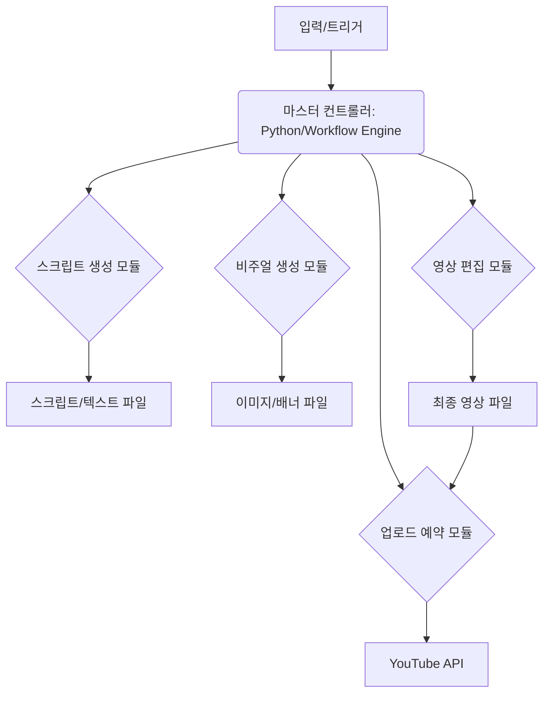

# 💻 Developer — 영상 기획부터 업로드까지의 완전 자동화 파이프라인(스크립트 생성 → 디자인 자동 적용 → 영상 편집 자동화 → 업로드 예약)을 위한 기술적 아키텍처(API 연동, 템플릿 구축)의 초기 설계안을 제시해줘.

💻 Developer: 작업 시작합니다.

## 🚀 완전 자동화 파이프라인 기술 아키텍처 초기 설계안

**결론: 완전 자동화는 가능합니다.**
이는 단순한 스크립트 자동화를 넘어, **LLM(대규모 언어 모델), 이미지 생성 AI, 비디오 편집 엔진, 그리고 외부 API(YouTube)를 통합하는 복합적인 AI 기반 데이터 파이프라인 구축**을 의미합니다. Marubyul의 인프라 구축 경험을 활용하여, 각 단계를 API로 연결하는 마스터 워크플로우 엔진을 구축하는 것이 핵심입니다.

### 1. 시스템 아키텍처 개요 (High-Level Architecture)

제안하는 시스템은 **'마스터 컨트롤러(Master Controller)'**를 중심으로 각 전문 모듈이 API를 통해 데이터를 주고받는 **모듈형 파이프라인(Modular Pipeline)** 구조입니다.



### 2. 핵심 모듈별 기술 스택 및 API 연동 설계

각 모듈은 특정 AI/API 서비스에 특화되며, 마스터 컨트롤러(Python 기반 권장)가 이들을 순차적으로 호출하고 결과를 통합합니다.

#### A. 📝 스크립트 생성 모듈 (Text Generation)

*   **목표:** 채널 기획에 따른 영상 대본(스크립트) 및 자막 자동 생성.
*   **핵심 기술:** LLM API (예: OpenAI GPT-4, Claude)
*   **API 연동 설계:**
    1.  **프롬프트 엔지니어링 템플릿:** 채널의 톤앤매너(직설적, ROI 중심)와 타깃 시청자(30-40대)를 반영한 **마스터 프롬프트 템플릿**을 구축합니다.
    2.  **스크립트 요청:** 마스터 컨트롤러가 주제를 입력하면, 템플릿에 주제를 삽입하여 LLM에 스크립트를 요청합니다.
    3.  **검증 및 정제:** 생성된 스크립트를 자체적으로 검토하여 Marubyul의 전문 용어가 적절히 사용되었는지 확인하는 후처리 로직을 추가합니다.
*   **실행 가능한 코드 (개념):**
    ```python
    # 예시: 스크립트 생성 함수 (실제 API 키 필요)
    def generate_script(topic: str, persona: str) -> str:
        prompt = f"당신은 Marubyul의 전문가입니다. 주제 '{topic}'에 대해 'AI를 자원으로, 당신의 시간을 시스템으로'라는 톤으로 5분 분량의 상세한 스크립트를 작성해 주세요. ROI와 자동화 경험을 강조해야 합니다."
        response = openai.ChatCompletion.create(model="gpt-4", messages=[{"role": "user", "content": prompt}])
        return response.choices[0].message.content
    ```

#### B. 비주얼 생성 모듈 (Visual Asset Generation)

*   **목표:** 스크립트 내용에 맞는 채널 아트, 썸네일 이미지, 영상 내 삽입될 시각 자료(B-roll) 자동 생성.
*   **핵심 기술:** 이미지 생성 API (예: DALL-E 3, Midjourney API)
*   **API 연동 설계:**
    1.  **키워드 추출:** 생성된 스크립트에서 핵심 키워드(예: Automation, ROI, System)를 추출하여 이미지 생성 프롬프트의 기반으로 사용합니다.
    2.  **썸네일 생성:** 각 영상의 주제에 맞춰, **Deep Navy와 Electric Cyan**의 색상 팔레트를 적용한 전문적인 썸네일 디자인을 생성하도록 API를 호출합니다.
*   **템플릿 구축:** 모든 영상에 일관된 톤을 유지하기 위해, 썸네일 디자인의 레이아웃(텍스트 위치, 색상 배치)을 정의한 **디자인 템플릿 파일(JSON/YAML)**을 구축하고 이를 API 호출에 삽입합니다.

#### C. 영상 편집 자동화 모듈 (Video Assembly & Editing)

*   **목표:** 스크립트, 생성된 이미지/영상 클립, 배경 음악을 조합하여 최종 영상을 자동 생성.
*   **핵심 기술:** FFmpeg (로컬 설치 및 API 연동), 클립 조립 라이브러리 (예: MoviePy)
*   **API 연동 설계:**
    1.  **오디오 동기화:** 스크립트의 텍스트를 TTS(Text-to-Speech) API를 통해 음성 파일로 변환하고, 이 음성 파일의 길이에 맞춰 시각 자료를 자릅니다.
    2.  **클립 삽입:** 생성된 이미지(썸네일, B-roll)와 TTS 음성을 FFmpeg를 사용하여 최종 영상 파일(.mp4)로 합치는 명령을 자동 실행합니다.
*   **자동화 포인트:** 이 단계는 **FFmpeg 명령어를 쉘 스크립트화**하여 마스터 컨트롤러가 실행하도록 설계합니다.

#### D. 업로드 예약 모듈 (Distribution)

*   **목표:** 최종 영상과 메타데이터를 YouTube에 자동으로 업로드하고 예약 발행.
*   **핵심 기술:** YouTube Data API v3
*   **API 연동 설계:**
    1.  **메타데이터 준비:** 스크립트, 제목, 설명, 태그(Keyword 리서치 결과 활용)를 DB 또는 JSON 형태로 준비합니다.
    2.  **API 호출:** 마스터 컨트롤러가 준비된 메타데이터와 최종 영상 파일을 YouTube API에 POST 요청으로 전송하여 업로드 및 예약 발행을 요청합니다.

### 3. 초기 구현 로드맵 (Next Steps)

1.  **Phase 1: PoC (Proof of Concept) - 스크립트 자동화**
    *   LLM API를 사용하여 채널 톤에 맞는 고품질 스크립트를 생성하는 단일 스
